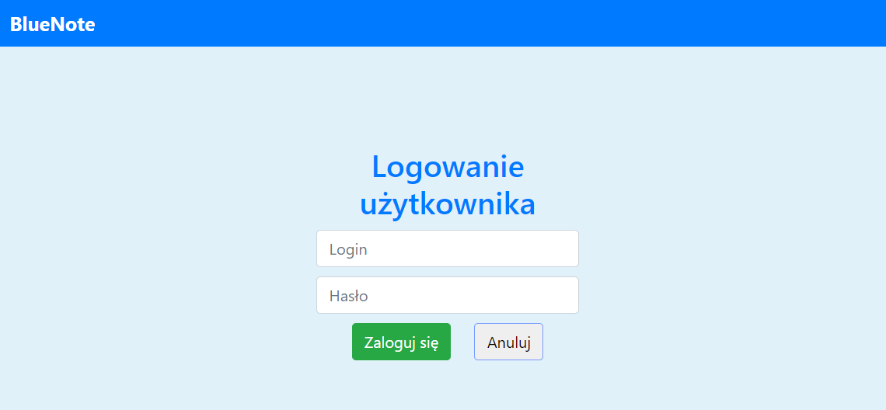

# BlueNote

The main purpose of this application is to support learning of playing guitar, 
by gaining knowledge about music theory.

## Installation

In API folder use commands:
1. `dotnet restore` to install dependencies,
2. `dotnet run` to run api server.

In Client folder use commands:
1. `npm update` to install dependencies,
2. `ng serve` to run angular.

## Build With

The aplication was build with: 
* [.NET 5.0](https://dotnet.microsoft.com/) - the web framework used for backend,
* [Angular 10](https://angular.io/) - web developer platform for frontend.

## Presentation

1. Main page

2. Become admin

3. Register form

4. Date of birth in register form

5. User login

6. Admin login

7. User home page

8. Admin home page

9. Changing account info

10. Lesson categories

11. List of lessons in selected category

12. Content of selected lesson

13. Creating lesson

14. Editing lesson

15. List of tests

16. Test

17. Test score

18. Creating test

19. Editing test

20. List of chords

21. Adding chords

22. Editing chords

23. Metronome

